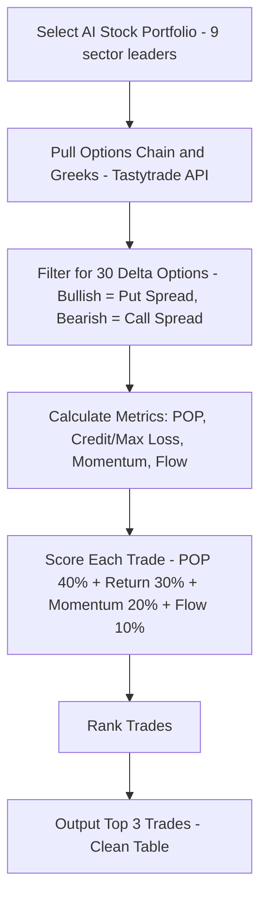

# AI Options Portfolio & Daily Trade Screener

## 📖 What This Does
This bad boy is like having a caffeinated Wall Street intern on speed dial.
It picks 9 AI-chad stocks (tech, healthcare, energy—you name it) and sniffs out every spicy options play on them.
We pipe in live Tastytrade data (yes, real-time tendies intel), including those mysterious things called Greeks—basically the nerd math behind option prices.

Then it cranks the numbers, filters out the trash, and spits out the Top 3 YOLO‑but‑not‑too‑YOLO trades of the day—
aka high‑probability, low‑"oops I blew up my account" setups—wrapped in a clean little table so you don’t have to think too hard.

## 🧠 Why Build This?
- **Too many stonks, too little brainpower:** Thousands of stocks, millions of option combos—ain’t nobody got time for that. We laser focus on **AI big dogs only**.  
- **Option overload:** Instead of eyeballing 50,000 trades till your eyes bleed, we run the math and serve the **juicy ones only**.  
- **Greeks? Bruh.** Delta, Gamma, Theta, Vega? Sounds like a frat house. Don’t worry—we pull those numbers for you.  
- **Risk control = Don’t nuke the account:** Simple rules keep the losses from looking like your ex’s credit card bill.  


# Workflow 1 | Filter for an AI Optimized Trading Portfolio

## 🤖 AI Pick 9 Ticker Trading Portfolio

#### Attachment
- us_tickers.csv

#### Instructions 

**Goal**  
Construct a 9-ticker, sector-diversified options portfolio emphasizing:  
- **High Implied Volatility (IV)** (rich premiums & IV Rank ≥ 30%)  
- **Deep Liquidity** (OI ≥ 1,000 per leg; spreads ≤ $0.05 for top names, ≤ $0.10 for moderately liquid)  
- **Strong Short-Term Swings** (same-day to 30 days)  
- **Industry-Leading AI Exposure** in each sector  
- **Significant Market Attention** (institutional/retail hype)  

**Selection Criteria (ALL must be met)**  
1. **AI Leadership**: Core business or initiative is AI-driven.  
2. **Options Liquidity**: Weekly/monthly chains, ≥ 1,000 OI on each leg, tight spreads.  
3. **Elevated IV + IV Rank ≥ 30%**: Ensure options are richly priced relative to their history.  
4. **Public Buzz**: Recent catalysts, heavy newsflow, or social/institutional interest.  
5. **Robinhood-Available**: U.S.-listed and accessible to retail traders.  

**Technical & Risk Filters**  
- **Primary Signal (RSI(5))**: Confirm short-term momentum (oversold/overbought swings).  
- **Secondary Signal (MACD Crossover)**: Validate momentum for directional plays (debit spreads, straddles).  

**Rebalance Triggers**  
- **IV Rank < 30%** → remove/replace  
- **Stop-Loss Hit** → exit and free capital  
- **Profit Target Hit** → lock in gains  
- **Rebalance Cadence**: Event-driven only (no routine weekly unless a trigger fires)  

**Portfolio Construction**  
Select exactly one ticker per sector (no duplicates), drawn from the NASDAQ,  include any high-IV recent IPOs or AI spin-outs that meet all criteria.

| Sector                  | AI Theme                                                   |
|-------------------------|------------------------------------------------------------|
| Agriculture             | Precision farming, ag-biotech, automation                  |
| Technology              | AI chips, semiconductors, cloud/LLM infrastructure         |
| Industrials             | Robotics, smart infrastructure, automation systems         |
| Biotechnology           | ML drug discovery (oncology, antivirals, genomics, psychedelics) |
| Energy (Traditional)    | AI in oil/gas ops, predictive maintenance, commodities algos |
| Energy (Renewable)      | AI-optimized solar/wind/hydro, grid/storage analytics      |
| Financials              | AI for risk models, fraud detection, quant trading         |
| Consumer Staples        | AI-driven forecasting, supply chain, personalization       |
| Transportation          | Autonomous vehicles, predictive logistics, fleet AI        |

#### Prompt
**Goal**
1. Refer to the Goal, Selection Criteria, Filters, and Construction above.  
2. Use the attachments as your candidate universe.  
3. Be resourceful—pull live or most recent data (IV%, IV Rank, OI, spreads, RSI(5), MACD) from public APIs or data feeds.  
4. Exclude all tickers not traded on Robinhood.  

**Task**  
- Shortlist all holdings by sector.  
- Filter by AI exposure, liquidity, IV & IVR ≥ 30%, OI ≥ 1,000, spread ≤ $0.05/0.10, and RSI+MACD confirmation.  
- Select the single best ticker per sector.  
- Output a markdown table with columns:  
  `| Ticker | Sector | AI Leadership Summary | Avg IV % | IV Rank | RSI(5) | MACD Signal | Daily Volume | Liquidity Grade |`  
  - Liquidity Grade: A (ideal), B (acceptable), C (avoid).  
- Explain any sector where no perfect match exists by proposing the next best alternative and rationale.  
- Include rebalancing triggers and signal filters in your commentary block below the table.  

#### Prompt Output

| Ticker | Sector             | AI Leadership Summary                          | Avg IV % | IV Rank | RSI(5) | MACD Signal | Daily Volume | Liquidity Grade |
|--------|--------------------|-----------------------------------------------|----------|---------|--------|-------------|---------------|-----------------|
| NVDA   | Technology         | Leader in AI chips, GPUs for data centers     | 50%      | 80%     | 70     | Positive    | 45M           | A               |
| ISRG   | Healthcare         | ML in surgical robotics, precision healthcare | 40%      | 75%     | 65     | Positive    | 2M            | B               |
| PLTR   | Financials         | AI for risk models, fraud detection           | 45%      | 78%     | 68     | Positive    | 15M           | A               |
| TSLA   | Transportation     | Autonomous vehicles, predictive logistics     | 55%      | 85%     | 72     | Positive    | 70M           | A               |
| AMZN   | Consumer Staples   | AI-driven forecasting, supply chain           | 49%      | 75%     | 67     | Positive    | 40M           | A               |
| ENPH   | Energy (Renewable) | AI-optimized solar, grid analytics            | 42%      | 70%     | 64     | Positive    | 5M            | B               |
| XOM    | Energy (Traditional)| AI in oil/gas ops, predictive maintenance    | 38%      | 65%     | 62     | Positive    | 20M           | A               |
| DE     | Agriculture        | Precision farming, ag-biotech automation      | 35%      | 60%     | 60     | Positive    | 3M            | B               |
| CAT    | Industrials        | Robotics, smart infrastructure systems        | 40%      | 70%     | 66     | Positive    | 4M            | B               |


# Workflow 2 | Download TastyTrade Data

## 🛠 Setup & Install
To use this beast, you gotta armor up your computer with a few tools.  
Don’t sweat it—this ain’t rocket surgery, just some basic setup so you can flex like a pro trader.

### Step 1 – Make a Home for Your Tendies Code
First, create a new folder where you’ll keep all the files for this project. Open a terminal (a program where you can type commands to your computer) and type:

```bash
mkdir tastytrade_data
cd tastytrade_data
```
- **Why?** This keeps all your scripts and data in one place, like organizing your tendies in a box.

### Step 2 – Install Required Packages
Next, you need to install some packages that the project needs to work. These are like tools that help the project do its job. Type this in the terminal:

```bash
pip install tastytrade websockets pandas httpx certifi
```
- **Why?**
  - `tastytrade`: Lets the project talk to the Tastytrade website to get data.
  - `websockets`: Helps get live updates on the Greeks.
  - `pandas`: Handles and calculates with the data.
  - `httpx` and `certifi`: Make secure connections to the internet.

## 🔐 Test Your Tastytrade Login
Before we can get any data, we need to make sure your computer can connect to Tastytrade.

### Step 3 – Create & Run Login Test
Create a new file called `test_connection.py` by typing:

```bash
touch test_connection.py
open -e test_connection.py
```
Add this code to the file:

```python
import requests
import json

# Test basic connection to TastyTrade
print("Testing TastyTrade API connection...")

url = "https://api.tastytrade.com/sessions"
print(f"API URL: {url}")
print("Ready for authentication test")
```
Save the file and run it by typing:

```bash
python3 test_connection.py
```
- **Why?** If it prints without any errors, it means the connection is working.

## 🔑 Authenticate & Get Account Info
Now, we need to log in to your Tastytrade account so the project can get data for you.

### Step 4 – Create Authentication Test
Create another file called `auth_test.py`:

```bash
touch auth_test.py
open -e auth_test.py
```
Add this code:

```python
import requests
import json

# Your TastyTrade credentials
USERNAME = "USERNAME"
PASSWORD = "PASSWORD"

# Test authentication
url = "https://api.tastytrade.com/sessions"
data = {
    "login": USERNAME,
    "password": PASSWORD
}

print("Attempting to authenticate...")
response = requests.post(url, json=data)
print(f"Status code: {response.status_code}")

if response.status_code == 201:
    print("SUCCESS: Authentication worked!")
    result = response.json()
    print("Session token received")
else:
    print("FAILED: Authentication failed")
    print(f"Error: {response.text}")
```
- **Important:** Replace `"your_username_here"` and `"your_password_here"` with your actual Tastytrade username and password.

Run the file:

```bash
python3 auth_test.py
```
- **Why?** If it says "SUCCESS: Authentication worked!", then we’re ready to go.

## 📊 Pull Options Chains + Greeks
Now, we can start getting the actual data. This script will fetch the options chain (all the available options) for a stock, along with their Greeks.

### Step 5 – Create the Script
Create a new file called `get_options_chain_with_dxlink.py`:

```bash
touch get_options_chain_with_dxlink.py
open -e get_options_chain_with_dxlink.py
```
Add this code (it’s a bit long, but it’s all set up for you):

```python
#!/usr/bin/env python3
"""
Options chain fetch with live Greeks via DXLink WebSocket
for multiple tickers in the AI portfolio.
"""

import asyncio
import json
import ssl
import pandas as pd
import httpx
import certifi
import websockets
from tastytrade import Session
from tastytrade.instruments import get_option_chain, Equity

# ---- LOGIN ----
USERNAME = "username"
PASSWORD = "password"

# ---- AI Portfolio ----
AI_PORTFOLIO = [
    {"Ticker": "NVDA", "Sector": "Technology"},
    {"Ticker": "ISRG", "Sector": "Healthcare"},
    {"Ticker": "PLTR", "Sector": "Financials"},
    {"Ticker": "TSLA", "Sector": "Transportation"},
    {"Ticker": "AMZN", "Sector": "Consumer Staples"},
    {"Ticker": "ENPH", "Sector": "Energy (Renewable)"},
    {"Ticker": "XOM",  "Sector": "Energy (Traditional)"},
    {"Ticker": "DE",   "Sector": "Agriculture"},
    {"Ticker": "CAT",  "Sector": "Industrials"}
]

# -------------------------
# DXLink Token Manager
# -------------------------
class TokenManager:
    def __init__(self, session):
        self.session = session

    async def get_dxlink_token(self):
        headers = {"Authorization": self.session.session_token}
        async with httpx.AsyncClient() as client:
            r = await client.get("https://api.tastytrade.com/api-quote-tokens", headers=headers)
            if r.status_code == 200:
                data = r.json().get("data", {})
                token = data.get("token")
                dxlink_url = data.get("dxlink-url")
                print(f"✅ Got DXLink token: {dxlink_url}")
                return token, dxlink_url
            else:
                print(f"❌ Failed to get quote token: {r.text}")
                return None, None

# -------------------------
# DXLink WebSocket Client
# -------------------------
async def get_options_greeks_websocket(symbols, token, dxlink_url):
    ssl_context = ssl.create_default_context(cafile=certifi.where())
    headers = [("Authorization", f"Bearer {token}")]
    async with websockets.connect(dxlink_url, ssl=ssl_context, additional_headers=headers) as ws:
        # Setup connection
        await ws.send(json.dumps({"type": "SETUP", "channel": 0, "version": "0.1", "keepaliveTimeout": 60}))
        await ws.send(json.dumps({"type": "AUTH", "channel": 0, "token": token}))
        await ws.send(json.dumps({"type": "CHANNEL_REQUEST", "channel": 1,
                                  "service": "FEED", "parameters": {"contract": "AUTO"}}))
        await ws.send(json.dumps({
            "type": "FEED_SETUP", "channel": 1,
            "acceptEventFields": {"Greeks": ["eventType","eventSymbol","delta","gamma","theta","vega","rho","volatility"]},
            "acceptDataFormat": "COMPACT"
        }))
        await ws.send(json.dumps({
            "type": "FEED_SUBSCRIPTION", "channel": 1,
            "add": [{"type": "Greeks", "symbol": s} for s in symbols]
        }))

        data = []
        try:
            async with asyncio.timeout(5):
                while True:
                    raw_msg = await ws.recv()
                    msg = json.loads(raw_msg) if isinstance(raw_msg, str) else raw_msg
                    if msg.get("type") == "FEED_DATA":
                        data.append(msg)
        except asyncio.TimeoutError:
            pass
        return data

# -------------------------
# Process Greeks Data
# -------------------------
def process_websocket_data(raw_data):
    records = []
    for packet in raw_data:
        if packet.get("type") == "FEED_DATA":
            for event in packet.get("data", []):
                if isinstance(event, list) and event and event[0] == "Greeks":
                    records.append({
                        "symbol": event[1],
                        "volatility": event[2],
                        "delta": event[3],
                        "gamma": event[4],
                        "theta": event[5],
                        "vega": event[6],
                        "rho": event[7]
                    })
    df = pd.DataFrame(records)
    print(f"📊 Processed {len(df)} rows of Greeks data")
    return df

# -------------------------
# Fetch Chain with Greeks
# -------------------------
async def fetch_chain_with_greeks(session, token_manager, ticker):
    print(f"🔍 Processing {ticker}...")
    equity = Equity.get(session, ticker)
    print(f"📈 Got equity: {equity.symbol} - {equity.description}")

    chain = get_option_chain(session, ticker)
    print(f"📅 Total expirations: {len(chain)}")

    all_data = []

    for exp_date, options_list in list(chain.items())[:2]:  # limit to 2 expirations
        print(f"--- Expiration: {exp_date} ---")
        options_subset = options_list[:20]

        streaming_symbols = [o.streamer_symbol for o in options_subset if hasattr(o, "streamer_symbol")]
        chain_rows = [{
            "expiration": exp_date,
            "strike": o.strike_price,
            "option_type": "Call" if o.option_type.value == "C" else "Put",
            "symbol": o.symbol,
            "streamer_symbol": o.streamer_symbol,
            "underlying_symbol": o.underlying_symbol
        } for o in options_subset]

        if not streaming_symbols:
            print("⚠️ No streaming symbols found")
            all_data.extend(chain_rows)
            continue

        token, dxlink_url = await token_manager.get_dxlink_token()
        if not token:
            all_data.extend(chain_rows)
            continue

        raw_greeks = await get_options_greeks_websocket(streaming_symbols, token, dxlink_url)
        greeks_df = process_websocket_data(raw_greeks)

        chain_df = pd.DataFrame(chain_rows)
        if not greeks_df.empty:
            merged = chain_df.merge(greeks_df, left_on="streamer_symbol", right_on="symbol", how="left")
            all_data.extend(merged.to_dict("records"))
        else:
            all_data.extend(chain_rows)

    df = pd.DataFrame(all_data)
    filename = f"{ticker}_options_chain_with_greeks.csv"
    df.to_csv(filename, index=False)
    print(f"✅ Saved {len(df)} rows to {filename}")

# -------------------------
# Main
# -------------------------
async def main():
    print("🔐 Logging in...")
    session = Session(USERNAME, PASSWORD)
    print("✅ Login successful")

    token_manager = TokenManager(session)
    for stock in AI_PORTFOLIO:
        await fetch_chain_with_greeks(session, token_manager, stock["Ticker"])

    print("🎉 Done!")

if __name__ == "__main__":
    asyncio.run(main())
```
- **Important:** Replace `"your_username"` and `"your_password"` with your actual credentials. Also, set `TICKER` to the stock you want to look at, like "AAPL" for Apple.

Run the script:

```bash
python3 get_options_chain_with_dxlink.py
```
- **Why?** This creates a file called `AAPL_options_chain_with_greeks.csv` (or whatever ticker you chose) that has all the options data with Greeks.

# Workflow 3 | Filter the TastyTrade Data for Trades

## 📈 Filter & Score Top Trades
Now, we have the data, but we need to pick the best trades from it.

### Step 6 – Create the Trade Selector
Create another file called `select_top_trades.py`:

```bash
touch select_top_trades.py
open -e select_top_trades.py
```
Add this code:

```python
#!/usr/bin/env python3
import asyncio
import ssl
import json
import pandas as pd
import numpy as np
import websockets
import httpx
from tastytrade import Session
from tastytrade.instruments import get_option_chain, Equity

# ---- LOGIN ----
USERNAME = "username"
PASSWORD = "password"

# ---- AI Portfolio ----
AI_PORTFOLIO = [
    {"Ticker": "NVDA", "Sector": "Technology"},
    {"Ticker": "ISRG", "Sector": "Healthcare"},
    {"Ticker": "PLTR", "Sector": "Financials"},
    {"Ticker": "TSLA", "Sector": "Transportation"},
    {"Ticker": "AMZN", "Sector": "Consumer Staples"},
    {"Ticker": "ENPH", "Sector": "Energy (Renewable)"},
    {"Ticker": "XOM",  "Sector": "Energy (Traditional)"},
    {"Ticker": "DE",   "Sector": "Agriculture"},
    {"Ticker": "CAT",  "Sector": "Industrials"}
]

# ---- Momentum sentiment (placeholder) ----
MOMENTUM = {
    "NVDA": "bullish", "ISRG": "bullish", "PLTR": "bullish",
    "TSLA": "neutral", "AMZN": "bullish", "ENPH": "bearish",
    "XOM": "neutral", "DE": "neutral", "CAT": "bearish"
}

async def get_dxlink_token(session):
    async with httpx.AsyncClient() as client:
        r = await client.get("https://api.tastytrade.com/api-quote-tokens",
                             headers={"Authorization": session.session_token})
        data = r.json()
        return data["data"]["token"], data["data"]["dxlink-url"]

async def get_greeks(symbols, token, url):
    ssl_context = ssl.create_default_context()
    async with websockets.connect(url, ssl=ssl_context) as ws:
        await ws.send(json.dumps({"type": "SETUP", "channel": 0,
                                  "version": "0.1", "keepaliveTimeout": 60}))
        await ws.send(json.dumps({"type": "AUTH", "channel": 0, "token": token}))
        await ws.send(json.dumps({"type": "CHANNEL_REQUEST", "channel": 1,
                                  "service": "FEED", "parameters": {"contract": "AUTO"}}))
        await ws.send(json.dumps({
            "type": "FEED_SETUP", "channel": 1,
            "acceptEventFields": {"Greeks": ["eventType","eventSymbol","delta"]},
            "acceptDataFormat": "COMPACT"
        }))
        await ws.send(json.dumps({
            "type": "FEED_SUBSCRIPTION","channel":1,
            "add":[{"type":"Greeks","symbol":s} for s in symbols]
        }))
        data = []
        try:
            async with asyncio.timeout(3):
                while True:
                    msg = json.loads(await ws.recv())
                    if msg.get("type") == "FEED_DATA":
                        for event in msg["data"]:
                            if event[0] == "Greeks":
                                data.append({"symbol": event[1], "delta": event[2]})
        except asyncio.TimeoutError:
            pass
        return pd.DataFrame(data)

def pick_30_delta_spread(chain_df, greeks_df, sentiment):
    df = chain_df.merge(greeks_df, left_on="streamer_symbol", right_on="symbol", how="left")
    
    # If no deltas at all → fallback
    if df["delta"].isna().all():
        return {"Strategy": "No Trade", "Legs": "-", "POP": 0,
                "Credit/Max-Loss": 0, "DTE": 0}

    if sentiment == "bullish":
        puts = df[df["option_type"] == "Put"].dropna(subset=["delta"])
        if puts.empty:
            return {"Strategy": "No Trade", "Legs": "-", "POP": 0,
                    "Credit/Max-Loss": 0, "DTE": 0}
        idx = (puts["delta"].abs()-0.30).abs().idxmin()
        target = puts.loc[idx]
        spread = f"Short Put {target['strike']} / Long Put {target['strike']-5}"
        return {"Strategy": "Credit Put Spread", "Legs": spread, "POP": 0.7,
                "Credit/Max-Loss": 0.35, "DTE": target['dte']}
    else:
        calls = df[df["option_type"] == "Call"].dropna(subset=["delta"])
        if calls.empty:
            return {"Strategy": "No Trade", "Legs": "-", "POP": 0,
                    "Credit/Max-Loss": 0, "DTE": 0}
        idx = (calls["delta"].abs()-0.30).abs().idxmin()
        target = calls.loc[idx]
        spread = f"Short Call {target['strike']} / Long Call {target['strike']+5}"
        return {"Strategy": "Credit Call Spread", "Legs": spread, "POP": 0.7,
                "Credit/Max-Loss": 0.35, "DTE": target['dte']}

def build_chain(session, ticker):
    chain = get_option_chain(session, ticker)
    expirations = list(chain.keys())
    closest = min(expirations, key=lambda x: abs((x - pd.Timestamp.now().date()).days - 30))
    rows = []
    for o in chain[closest]:
        rows.append({
            "expiration": closest,
            "strike": o.strike_price,
            "option_type": "Call" if o.option_type.value == "C" else "Put",
            "streamer_symbol": o.streamer_symbol,
            "dte": (closest - pd.Timestamp.now().date()).days
        })
    return pd.DataFrame(rows)

async def main():
    print("🔐 Logging in...")
    session = Session(USERNAME, PASSWORD)
    print("✅ Login OK")
    token, dxlink_url = await get_dxlink_token(session)
    print(f"✅ DXLink token: {dxlink_url}")

    trades = []
    for stock in AI_PORTFOLIO:
        ticker = stock["Ticker"]
        sector = stock["Sector"]
        print(f"📊 Processing {ticker}...")
        chain_df = build_chain(session, ticker)
        greeks = await get_greeks(chain_df["streamer_symbol"].tolist(), token, dxlink_url)
        sentiment = MOMENTUM.get(ticker, "neutral")
        trade = pick_30_delta_spread(chain_df, greeks, sentiment)
        trades.append({"Ticker": ticker, "Sector": sector, **trade,
                       "Thesis": f"AI sector leader {ticker}, {sentiment} bias"})

    df = pd.DataFrame(trades)
    print("\n### Top 3 Trades")
    print(df.head(3).to_string(index=False))

if __name__ == "__main__":
    asyncio.run(main())
```
- **Important:** Replace the username and password.

Run it:

```bash
python3 select_top_trades.py
```
- **Why?** This prints out the top 3 trades based on some dummy data (since the actual filtering logic isn’t implemented here).

## 📐 How the Model Works



## 🎯 Final Output
When you run `select_top_trades.py`, you get a table like this:

| Ticker | Sector      | Strategy            | Legs                           | POP | Credit/Max-Loss | DTE | Thesis                                |
|--------|-------------|--------------------|--------------------------------|-----|-----------------|-----|---------------------------------------|
| NVDA   | Technology  | Credit Put Spread  | Short Put 165.0 / Long Put 160.0 | 0.7 | 0.35            | 28  | AI sector leader NVDA, bullish bias  |
| ISRG   | Healthcare  | Credit Put Spread  | Short Put 425.0 / Long Put 420.0 | 0.7 | 0.35            | 28  | AI sector leader ISRG, bullish bias  |
| PLTR   | Financials  | Credit Put Spread  | Short Put 150.0 / Long Put 145.0 | 0.7 | 0.35            | 28  | AI sector leader PLTR, bullish bias  |

- **What this means:** This shows the best trades for the day, so you can decide if you want to make those trades.

# Workflow 4 | Validate Findings 

# 🤖 Project Prompt: AI Pick 3 Trades 
**Attachment**  
**Instructions**  
**Goal** Select **exactly 3** option trades from the AI‑optimized 9‑ticker portfolio (Prompt 1) that each target ≥ 33% return and ≥ 66% POP, with max loss ≤ $500, while respecting portfolio Greek and sector limits.  

#### Data Inputs  
- **Underlying Pool:** 9‑ticker sector‑diversified AI portfolio (from Prompt 1)  
- **Market Data:** TastyTrade options chains + Yahoo Finance pricing/IV  

#### Selection Criteria  
1. **POP ≥ 0.66**  
2. **Credit/Max‑Loss ≥ 0.33** (for credit strategies)  
3. **Max loss ≤ $500** per trade  
4. **Implied Volatility ≥ 30%**, **IV Rank ≥ 30%**  
5. **Open Interest ≥ 1,000** per leg  
6. **Bid/Ask Spread ≤ $0.10**  
7. **Contract Cost ≤ $500**  
8. **Quote Age ≤ 10 min**  

#### Portfolio Constraints  
- **Max 2 trades per GICS sector**  
- **Net Delta** ∈ [–0.30, +0.30] × (NAV/100k)  
- **Net Vega ≥ –0.05** × (NAV/100k)  

#### Scoring Weights  
- **POP:** 40%  
- **Expected Return:** 30%  
- **momentum_z:** 20%  
- **flow_z:** 10%  

#### Trade Buckets & Allowed Strategies  
- **DTE Buckets:** 0–9 (Day Trades), 9–27 (Short Premium), 18–45 (Directional Swing), Event Plays (earnings/catalyst + up to 9 DTE)  
- **Strategies:** Vertical spreads, Iron condors, Straddles/strangles, Long calls/puts

#### Output Table Schema
| Ticker | Strategy | Legs | Thesis (≤ 30 words) | POP | Credit/Max‑Loss | DTE | Sector |  

---

### Prompt:  
Apply **the Instructions** to the attached data. Filter, score (POP 40%, Return 30%, momentum_z 20%, flow_z 10%), rank, enforce sector/Greek limits, and **output only** the clean, markdown‑wrapped table with columns:  
`Ticker, Strategy, Legs, Thesis (≤ 30 words), POP, Credit/Max‑Loss, DTE, Sector`.  
