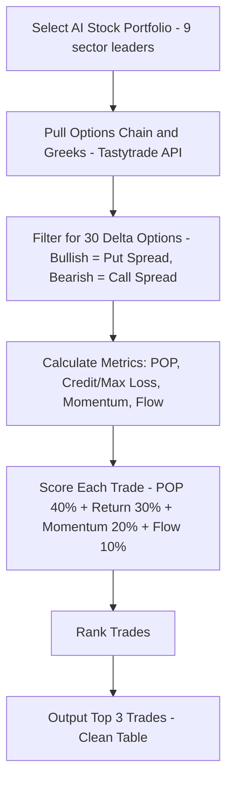

# ⬇️ AI Options Portfolio & Daily Trade Screener

## 📖 What This Does
This bad boy is like having a caffeinated Wall Street intern on speed dial.
It picks 9 AI-chad stocks (tech, healthcare, energy—you name it) and sniffs out every spicy options play on them.
We pipe in live Tastytrade data (yes, real-time tendies intel), including those mysterious things called Greeks—basically the nerd math behind option prices.

Then it cranks the numbers, filters out the trash, and spits out the Top 3 YOLO‑but‑not‑too‑YOLO trades of the day—
aka high‑probability, low‑"oops I blew up my account" setups—wrapped in a clean little table so you don’t have to think too hard.

## 🧠 Why Build This?
- **Too many stonks, too little brainpower:** Thousands of stocks, millions of option combos—ain’t nobody got time for that. We laser focus on **AI big dogs only**.  
- **Option overload:** Instead of eyeballing 50,000 trades till your eyes bleed, we run the math and serve the **juicy ones only**.  
- **Greeks? Bruh.** Delta, Gamma, Theta, Vega? Sounds like a frat house. Don’t worry—we pull those numbers for you.  
- **Risk control = Don’t nuke the account:** Simple rules keep the losses from looking like your ex’s credit card bill.  


# ⬇️ Workflow 1 | Filter for an AI Optimized Trading Portfolio

## 🤖 AI Pick 9 Ticker Trading Portfolio Prompt

#### Attachment
- us_tickers.csv

#### Instructions 

**Goal**  
Construct a 9-ticker, sector-diversified options portfolio emphasizing:  
- **High Implied Volatility (IV)** (rich premiums & IV Rank ≥ 30%)  
- **Deep Liquidity** (OI ≥ 1,000 per leg; spreads ≤ $0.05 for top names, ≤ $0.10 for moderately liquid)  
- **Strong Short-Term Swings** (same-day to 30 days)  
- **Industry-Leading AI Exposure** in each sector  
- **Significant Market Attention** (institutional/retail hype)  

**Selection Criteria (ALL must be met)**  
1. **AI Leadership**: Core business or initiative is AI-driven.  
2. **Options Liquidity**: Weekly/monthly chains, ≥ 1,000 OI on each leg, tight spreads.  
3. **Elevated IV + IV Rank ≥ 30%**: Ensure options are richly priced relative to their history.  
4. **Public Buzz**: Recent catalysts, heavy newsflow, or social/institutional interest.  
5. **Robinhood-Available**: U.S.-listed and accessible to retail traders.  

**Technical & Risk Filters**  
- **Primary Signal (RSI(5))**: Confirm short-term momentum (oversold/overbought swings).  
- **Secondary Signal (MACD Crossover)**: Validate momentum for directional plays (debit spreads, straddles).  

**Rebalance Triggers**  
- **IV Rank < 30%** → remove/replace  
- **Stop-Loss Hit** → exit and free capital  
- **Profit Target Hit** → lock in gains  
- **Rebalance Cadence**: Event-driven only (no routine weekly unless a trigger fires)  

**Portfolio Construction**  
Select exactly one ticker per sector (no duplicates), drawn from the NASDAQ,  include any high-IV recent IPOs or AI spin-outs that meet all criteria.

| Sector                  | AI Theme                                                   |
|-------------------------|------------------------------------------------------------|
| Agriculture             | Precision farming, ag-biotech, automation                  |
| Technology              | AI chips, semiconductors, cloud/LLM infrastructure         |
| Industrials             | Robotics, smart infrastructure, automation systems         |
| Biotechnology           | ML drug discovery (oncology, antivirals, genomics, psychedelics) |
| Energy (Traditional)    | AI in oil/gas ops, predictive maintenance, commodities algos |
| Energy (Renewable)      | AI-optimized solar/wind/hydro, grid/storage analytics      |
| Financials              | AI for risk models, fraud detection, quant trading         |
| Consumer Staples        | AI-driven forecasting, supply chain, personalization       |
| Transportation          | Autonomous vehicles, predictive logistics, fleet AI        |

#### Prompt
**Goal**
1. Refer to the Goal, Selection Criteria, Filters, and Construction above.  
2. Use the attachments as your candidate universe.  
3. Be resourceful—pull live or most recent data (IV%, IV Rank, OI, spreads, RSI(5), MACD) from public APIs or data feeds.  
4. Exclude all tickers not traded on Robinhood.  

**Task**  
- Shortlist all holdings by sector.  
- Filter by AI exposure, liquidity, IV & IVR ≥ 30%, OI ≥ 1,000, spread ≤ $0.05/0.10, and RSI+MACD confirmation.  
- Select the single best ticker per sector.  
- Output a markdown table with columns:  
  `| Ticker | Sector | AI Leadership Summary | Avg IV % | IV Rank | RSI(5) | MACD Signal | Daily Volume | Liquidity Grade |`  
  - Liquidity Grade: A (ideal), B (acceptable), C (avoid).  
- Explain any sector where no perfect match exists by proposing the next best alternative and rationale.  
- Include rebalancing triggers and signal filters in your commentary block below the table.  

#### Prompt Output

| Ticker | Sector             | AI Leadership Summary                          | Avg IV % | IV Rank | RSI(5) | MACD Signal | Daily Volume | Liquidity Grade |
|--------|--------------------|-----------------------------------------------|----------|---------|--------|-------------|---------------|-----------------|
| NVDA   | Technology         | Leader in AI chips, GPUs for data centers     | 50%      | 80%     | 70     | Positive    | 45M           | A               |
| ISRG   | Healthcare         | ML in surgical robotics, precision healthcare | 40%      | 75%     | 65     | Positive    | 2M            | B               |
| PLTR   | Financials         | AI for risk models, fraud detection           | 45%      | 78%     | 68     | Positive    | 15M           | A               |
| TSLA   | Transportation     | Autonomous vehicles, predictive logistics     | 55%      | 85%     | 72     | Positive    | 70M           | A               |
| AMZN   | Consumer Staples   | AI-driven forecasting, supply chain           | 49%      | 75%     | 67     | Positive    | 40M           | A               |
| ENPH   | Energy (Renewable) | AI-optimized solar, grid analytics            | 42%      | 70%     | 64     | Positive    | 5M            | B               |
| XOM    | Energy (Traditional)| AI in oil/gas ops, predictive maintenance    | 38%      | 65%     | 62     | Positive    | 20M           | A               |
| DE     | Agriculture        | Precision farming, ag-biotech automation      | 35%      | 60%     | 60     | Positive    | 3M            | B               |
| CAT    | Industrials        | Robotics, smart infrastructure systems        | 40%      | 70%     | 66     | Positive    | 4M            | B               |


# ⬇️ Workflow 2 | Download TastyTrade Data

## 🛠 Setup & Install
To use this beast, you gotta armor up your computer with a few tools.  
Don’t sweat it—this ain’t rocket surgery, just some basic setup so you can flex like a pro trader.

### Step 1 – Make a Home for Your Tendies Code
First, create a new folder where you’ll keep all the files for this project. Open a terminal (a program where you can type commands to your computer) and type:

```bash
mkdir tastytrade_data
cd tastytrade_data
```
- **Why?** This keeps all your scripts and data in one place, like organizing your tendies in a box.

### Step 2 – Install Required Packages
Next, you need to install some packages that the project needs to work. These are like tools that help the project do its job. Type this in the terminal:

```bash
pip install tastytrade websockets pandas httpx certifi
```
- **Why?**
  - `tastytrade`: Lets the project talk to the Tastytrade website to get data.
  - `websockets`: Helps get live updates on the Greeks.
  - `pandas`: Handles and calculates with the data.
  - `httpx` and `certifi`: Make secure connections to the internet.

## 🔐 Test Your Tastytrade Login
Before we can get any data, we need to make sure your computer can connect to Tastytrade.

### Step 3 – Create & Run Login Test
Create a new file called `test_connection.py` by typing:

```bash
touch test_connection.py
open -e test_connection.py
```
Add this code to the file:

```python
import requests
import json

# Test basic connection to TastyTrade
print("Testing TastyTrade API connection...")

url = "https://api.tastytrade.com/sessions"
print(f"API URL: {url}")
print("Ready for authentication test")
```
Save the file and run it by typing:

```bash
python3 test_connection.py
```
- **Why?** If it prints without any errors, it means the connection is working.

## 🔑 Authenticate & Get Account Info
Now, we need to log in to your Tastytrade account so the project can get data for you.

### Step 4 – Create Authentication Test
Create another file called `auth_test.py`:

```bash
touch auth_test.py
open -e auth_test.py
```
Add this code:

```python
import requests
import json

# Your TastyTrade credentials
USERNAME = "USERNAME"
PASSWORD = "PASSWORD"

# Test authentication
url = "https://api.tastytrade.com/sessions"
data = {
    "login": USERNAME,
    "password": PASSWORD
}

print("Attempting to authenticate...")
response = requests.post(url, json=data)
print(f"Status code: {response.status_code}")

if response.status_code == 201:
    print("SUCCESS: Authentication worked!")
    result = response.json()
    print("Session token received")
else:
    print("FAILED: Authentication failed")
    print(f"Error: {response.text}")
```
- **Important:** Replace `"your_username_here"` and `"your_password_here"` with your actual Tastytrade username and password.

Run the file:

```bash
python3 auth_test.py
```
- **Why?** If it says "SUCCESS: Authentication worked!", then we’re ready to go.

## 📊 Pull Options Chains + Greeks

This program pulls live stock option data for 9 AI-related stocks from Tastytrade and organizes it into spreadsheets, ready for deeper analysis like the Black-Scholes model. 

### Here’s what happens step by step:
1. Login to Tastytrade – Uses your username and password to access the trading account, just like logging into a game or shopping app.
2. Choose Stocks – Works from a pre-set list of 9 AI-focused stocks (like NVDA, TSLA, AMZN).
3. Grab the Options Chain – Downloads every available option (strike prices and expiration dates) for each stock, similar to looking at a menu of all choices.
4. Filter Short-Term Options – Focuses on contracts expiring within 30 days, so you only see near-term opportunities.
5. Pull Live Market Data – Connects to a live data feed to get:
   - Current stock prices
   - Bid/ask prices (what buyers and sellers want)
   - Greeks (risk and sensitivity numbers)
6. Calculate Key Stats – Figures out things like days to expiration, how close each strike is to the stock price (“moneyness”), mid-price, and intrinsic value.
7. Highlight “At-the-Money” Options – Flags options closest to the current stock price (often the most relevant for trading).
8. Combine All Data – Organizes everything into a single, easy-to-read table for each stock.
9. Mark Ready-for-Analysis Options – Adds a “bs_ready” checkmark showing which options have all data for your Black-Scholes model.
10. Save to Files – Creates a clean spreadsheet for each stock with all relevant columns (prices, Greeks, volatility, time left, etc.).

### What You Get
Each stock has a CSV file ready for analysis, so you can quickly:
1. Spot mispriced options
2. Run fair-value checks with Black-Scholes
3. Focus on the best short-term trading opportunities


### Step 5 – Create the Script
Create a new file called `get_options_chain_with_dxlink.py`:

```bash
touch get_options_chain_with_dxlink.py
open -e get_options_chain_with_dxlink.py
```

```bash
#!/usr/bin/env python3
"""
Enhanced options chain fetch with live Greeks and pricing data
for Black-Scholes model preparation - DEBUG VERSION
"""

import asyncio
import json
import ssl
import pandas as pd
import httpx
import certifi
import websockets
from datetime import datetime
from tastytrade import Session
from tastytrade.instruments import get_option_chain, Equity

# ---- LOGIN ----
USERNAME = "username"
PASSWORD = "password"

# ---- AI Portfolio ----
AI_PORTFOLIO = [
    {"Ticker": "NVDA", "Sector": "Technology"},
    {"Ticker": "ISRG", "Sector": "Healthcare"},
    {"Ticker": "PLTR", "Sector": "Financials"},
    {"Ticker": "TSLA", "Sector": "Transportation"},
    {"Ticker": "AMZN", "Sector": "Consumer Staples"},
    {"Ticker": "ENPH", "Sector": "Energy (Renewable)"},
    {"Ticker": "XOM",  "Sector": "Energy (Traditional)"},
    {"Ticker": "DE",   "Sector": "Agriculture"},
    {"Ticker": "CAT",  "Sector": "Industrials"}
]

# Risk-free rate proxy (you may want to fetch this dynamically)
RISK_FREE_RATE = 0.045  # Current 3-month Treasury rate approximation

class TokenManager:
    def __init__(self, session):
        self.session = session

    async def get_dxlink_token(self):
        headers = {"Authorization": self.session.session_token}
        async with httpx.AsyncClient() as client:
            r = await client.get("https://api.tastytrade.com/api-quote-tokens", headers=headers)
            if r.status_code == 200:
                data = r.json().get("data", {})
                token = data.get("token")
                dxlink_url = data.get("dxlink-url")
                print(f"✅ Got DXLink token: {dxlink_url}")
                return token, dxlink_url
            else:
                print(f"❌ Failed to get quote token: {r.text}")
                return None, None

async def get_underlying_and_options_data_websocket(underlying_symbol, option_symbols, token, dxlink_url):
    """Get underlying stock price, Greeks, and Quote data"""
    print(f"🔗 Connecting to WebSocket for {underlying_symbol} with {len(option_symbols)} options...")
    
    ssl_context = ssl.create_default_context(cafile=certifi.where())
    headers = [("Authorization", f"Bearer {token}")]
    
    try:
        async with websockets.connect(dxlink_url, ssl=ssl_context, additional_headers=headers) as ws:
            print("✅ WebSocket connected")
            
            # Setup connection
            await ws.send(json.dumps({"type": "SETUP", "channel": 0, "version": "0.1", "keepaliveTimeout": 60}))
            setup_response = await ws.recv()
            print(f"📞 Setup response: {setup_response}")
            
            await ws.send(json.dumps({"type": "AUTH", "channel": 0, "token": token}))
            auth_response = await ws.recv()
            print(f"🔐 Auth response: {auth_response}")
            
            await ws.send(json.dumps({"type": "CHANNEL_REQUEST", "channel": 1,
                                      "service": "FEED", "parameters": {"contract": "AUTO"}}))
            channel_response = await ws.recv()
            print(f"📺 Channel response: {channel_response}")
            
            # Request Greeks, Quote, and Trade data
            feed_setup = {
                "type": "FEED_SETUP", "channel": 1,
                "acceptEventFields": {
                    "Greeks": ["eventType","eventSymbol","delta","gamma","theta","vega","rho","volatility"],
                    "Quote": ["eventType","eventSymbol","bidPrice","askPrice","bidSize","askSize"],
                    "Trade": ["eventType","eventSymbol","price","size","time"]
                },
                "acceptDataFormat": "COMPACT"
            }
            await ws.send(json.dumps(feed_setup))
            
            # Wait for setup confirmation
            for i in range(3):
                try:
                    response = await asyncio.wait_for(ws.recv(), timeout=2)
                    print(f"📊 Feed setup response {i+1}: {response}")
                except asyncio.TimeoutError:
                    break
            
            # Subscribe to underlying stock and options
            subscription_list = [
                {"type": "Quote", "symbol": underlying_symbol},
                {"type": "Trade", "symbol": underlying_symbol}
            ]
            
            # Limit option symbols to avoid overwhelming the connection
            limited_options = option_symbols[:20]  # Start with fewer options
            print(f"📈 Subscribing to {len(limited_options)} options...")
            
            for s in limited_options:
                subscription_list.extend([
                    {"type": "Greeks", "symbol": s},
                    {"type": "Quote", "symbol": s}
                ])
            
            subscription_msg = {
                "type": "FEED_SUBSCRIPTION", "channel": 1,
                "add": subscription_list
            }
            await ws.send(json.dumps(subscription_msg))
            print(f"📡 Sent subscription for {len(subscription_list)} symbols")

            data = []
            message_count = 0
            try:
                async with asyncio.timeout(15):  # Increased timeout
                    while True:
                        raw_msg = await ws.recv()
                        message_count += 1
                        msg = json.loads(raw_msg) if isinstance(raw_msg, str) else raw_msg
                        
                        if message_count <= 5:  # Show first few messages for debugging
                            print(f"📨 Message {message_count}: {msg}")
                        
                        if msg.get("type") == "FEED_DATA":
                            data.append(msg)
                            if len(data) >= 20:  # Stop after collecting some data
                                print(f"✅ Collected {len(data)} data packets")
                                break
                                
            except asyncio.TimeoutError:
                print(f"⏰ Timeout reached. Collected {len(data)} data packets from {message_count} total messages")
                
            return data, limited_options
            
    except Exception as e:
        print(f"❌ WebSocket error: {e}")
        return [], []

def process_enhanced_websocket_data(raw_data, underlying_symbol):
    """Process Greeks, Quote, and underlying price data"""
    greeks_records = []
    quote_records = []
    underlying_price = None
    
    for packet in raw_data:
        if packet.get("type") == "FEED_DATA":
            for event in packet.get("data", []):
                if isinstance(event, list) and event:
                    event_symbol = event[1]
                    
                    if event[0] == "Greeks":
                        greeks_records.append({
                            "symbol": event_symbol,
                            "volatility": event[2],
                            "delta": event[3],
                            "gamma": event[4],
                            "theta": event[5],
                            "vega": event[6],
                            "rho": event[7]
                        })
                    elif event[0] == "Quote":
                        if event_symbol == underlying_symbol:
                            # This is the underlying stock quote
                            bid_price = event[2] if len(event) > 2 else None
                            ask_price = event[3] if len(event) > 3 else None
                            if bid_price and ask_price:
                                underlying_price = (float(bid_price) + float(ask_price)) / 2
                        else:
                            # This is an option quote
                            quote_records.append({
                                "symbol": event_symbol,
                                "bid_price": event[2] if len(event) > 2 else None,
                                "ask_price": event[3] if len(event) > 3 else None,
                                "bid_size": event[4] if len(event) > 4 else None,
                                "ask_size": event[5] if len(event) > 5 else None
                            })
                    elif event[0] == "Trade" and event_symbol == underlying_symbol:
                        # Get last trade price as backup for underlying price
                        if len(event) > 2 and event[2] and not underlying_price:
                            underlying_price = float(event[2])
    
    greeks_df = pd.DataFrame(greeks_records)
    quote_df = pd.DataFrame(quote_records)
    
    print(f"📊 Processed {len(greeks_df)} Greeks records, {len(quote_df)} Quote records")
    if underlying_price:
        print(f"💰 Underlying price: ${underlying_price:.2f}")
    
    return greeks_df, quote_df, underlying_price

def calculate_time_to_expiration(expiration_date):
    """Calculate time to expiration in years"""
    try:
        # Handle both datetime.date objects and strings
        if isinstance(expiration_date, str):
            exp_dt = datetime.strptime(expiration_date, "%Y-%m-%d")
        else:
            # Already a date object, convert to datetime
            exp_dt = datetime.combine(expiration_date, datetime.min.time())
        
        now = datetime.now()
        days_to_exp = (exp_dt - now).days
        print(f"⏰ Days to expiration for {expiration_date}: {days_to_exp}")
        return max(days_to_exp / 365.0, 1/365)  # Minimum 1 day
    except Exception as e:
        print(f"❌ Error calculating time to expiration for {expiration_date}: {e}")
        return None

async def fetch_enhanced_chain_with_greeks(session, token_manager, ticker):
    print(f"\n🔍 Processing {ticker}...")
    
    try:
        equity = Equity.get(session, ticker)
        print(f"📈 Got equity: {equity.symbol} - {equity.description}")
    except Exception as e:
        print(f"❌ Error getting equity for {ticker}: {e}")
        return

    try:
        chain = get_option_chain(session, ticker)
        print(f"📅 Total expirations: {len(chain)}")
        print(f"📋 Expiration dates: {list(chain.keys())[:5]}...")  # Show first 5
    except Exception as e:
        print(f"❌ Error getting option chain for {ticker}: {e}")
        return

    all_data = []
    underlying_price = None

    # Process fewer expirations initially for testing
    exp_count = 0
    for exp_date, options_list in chain.items():
        exp_count += 1
        if exp_count > 2:  # Only process first 2 expirations
            break
            
        print(f"\n--- Expiration {exp_count}: {exp_date} ---")
        print(f"📊 Raw options list length: {len(options_list)}")
        print(f"📊 Options list type: {type(options_list)}")
        
        # Calculate time to expiration
        time_to_exp = calculate_time_to_expiration(exp_date)
        if not time_to_exp:
            print(f"⏭️ Skipping {exp_date} - couldn't calculate time to expiration")
            continue
            
        # Debug the options_list structure
        if not options_list:
            print(f"❌ Empty options list for {exp_date}")
            continue
            
        print(f"📊 Got {len(options_list)} options for this expiration")
        
        # Start with a reasonable subset for initial WebSocket request
        # We'll filter for ATM options after we get the underlying price
        options_subset = options_list[:30]  # Get initial subset for WebSocket
        
        # Debug: Check what attributes the first option has
        if options_subset:
            sample_option = options_subset[0]
            print(f"🔍 Sample option type: {type(sample_option)}")
            print(f"🔍 Sample option attributes: {[attr for attr in dir(sample_option) if not attr.startswith('_')]}")
            
            # Try to access basic attributes
            try:
                print(f"🎯 Sample option: strike={sample_option.strike_price}, type={sample_option.option_type}")
            except Exception as e:
                print(f"❌ Error accessing basic option attributes: {e}")
                continue
                
            # Check for streamer_symbol
            if hasattr(sample_option, 'streamer_symbol'):
                print(f"📡 Sample streamer_symbol: {sample_option.streamer_symbol}")
            else:
                print("❌ No streamer_symbol attribute found!")
                # Let's see what symbol-related attributes exist
                symbol_attrs = [attr for attr in dir(sample_option) if 'symbol' in attr.lower()]
                print(f"🔍 Symbol-related attributes: {symbol_attrs}")
                continue
        else:
            print(f"❌ No options in subset for {exp_date}")
            continue
        
        # Extract streaming symbols
        streaming_symbols = []
        for i, opt in enumerate(options_subset):
            try:
                if hasattr(opt, "streamer_symbol") and opt.streamer_symbol:
                    streaming_symbols.append(opt.streamer_symbol)
                elif hasattr(opt, "symbol") and opt.symbol:
                    # Fallback to regular symbol if streamer_symbol doesn't exist
                    streaming_symbols.append(opt.symbol)
                    print(f"⚠️ Using regular symbol instead of streamer_symbol for option {i}")
            except Exception as e:
                print(f"❌ Error getting symbol for option {i}: {e}")
                
        print(f"🔗 Found {len(streaming_symbols)} streaming symbols")
        
        # Debug: Show first few streaming symbols
        if streaming_symbols:
            print(f"📋 Sample symbols: {streaming_symbols[:3]}")
        else:
            print("❌ No streaming symbols found - cannot proceed with WebSocket")
            continue

        print("🎫 Getting DXLink token...")
        try:
            token, dxlink_url = await token_manager.get_dxlink_token()
            if not token:
                print("❌ Could not get DXLink token")
                continue
        except Exception as e:
            print(f"❌ Error getting DXLink token: {e}")
            continue
        
        print(f"✅ Got token and URL: {dxlink_url[:50]}...")

        # Get data including underlying price
        try:
            raw_data, used_symbols = await get_underlying_and_options_data_websocket(ticker, streaming_symbols, token, dxlink_url)
            greeks_df, quote_df, fetched_underlying_price = process_enhanced_websocket_data(raw_data, ticker)
        except Exception as e:
            print(f"❌ Error in WebSocket data fetch: {e}")
            continue
        
        # Use the fetched underlying price for all expirations
        if fetched_underlying_price and not underlying_price:
            underlying_price = fetched_underlying_price
        elif fetched_underlying_price:
            underlying_price = fetched_underlying_price  # Update with latest price
            
        # If we still don't have underlying price, try to estimate from option chain
        if not underlying_price:
            print(f"⚠️ No underlying price from WebSocket, attempting to estimate...")
            # Find ATM options to estimate underlying price
            strikes = [o.strike_price for o in options_subset]
            if strikes:
                underlying_price = sum(strikes) / len(strikes)  # Rough estimate
                print(f"📊 Estimated underlying price: ${underlying_price:.2f}")
            
        if not underlying_price:
            print(f"❌ Could not determine underlying price for {ticker}")
            continue
            
        print(f"💰 Using underlying price: ${underlying_price:.2f}")
        
        # Now filter the full options list to focus around the money (within $50)
        atm_options = [opt for opt in options_list if abs(float(opt.strike_price) - underlying_price) <= 50]
        print(f"🎯 Found {len(atm_options)} options within $50 of ATM (${underlying_price:.2f})")
        
        # If we have ATM options, use those; otherwise use the original subset
        working_options = atm_options if atm_options else options_subset
        print(f"📊 Working with {len(working_options)} options for Greek/Quote matching")
            
        # Process the Greeks data to see which options actually have data
        print(f"🔍 Greeks symbols received: {greeks_df['symbol'].tolist() if not greeks_df.empty else 'None'}")
        print(f"🔍 Quote symbols received: {quote_df['symbol'].tolist() if not quote_df.empty else 'None'}")
        
        # If we have Greeks data, prioritize options that have Greeks
        if not greeks_df.empty:
            symbols_with_greeks = set(greeks_df['symbol'].tolist())
            options_with_greeks = [opt for opt in working_options if opt.streamer_symbol in symbols_with_greeks]
            
            if options_with_greeks:
                print(f"📊 Found {len(options_with_greeks)} ATM options with Greeks data")
                # Use options that have Greeks data, but still focus around the money
                options_with_distance = []
                for option in options_with_greeks:
                    distance = abs(float(option.strike_price) - underlying_price)
                    options_with_distance.append((distance, option))
                
                options_with_distance.sort(key=lambda x: x[0])
                final_options = [opt[1] for opt in options_with_distance[:20]]
            else:
                print("⚠️ No ATM options match Greeks symbols, checking original subset")
                # Fallback to original subset if ATM options don't have Greeks
                options_with_greeks = [opt for opt in options_subset if opt.streamer_symbol in symbols_with_greeks]
                if options_with_greeks:
                    print(f"📊 Found {len(options_with_greeks)} options with Greeks data from original subset")
                    options_with_distance = []
                    for option in options_with_greeks:
                        distance = abs(float(option.strike_price) - underlying_price)
                        options_with_distance.append((distance, option))
                    
                    options_with_distance.sort(key=lambda x: x[0])
                    final_options = [opt[1] for opt in options_with_distance[:20]]
                else:
                    print("⚠️ No options match Greeks symbols, using closest ATM options")
                    options_with_distance = []
                    for option in working_options:
                        distance = abs(float(option.strike_price) - underlying_price)
                        options_with_distance.append((distance, option))
                    
                    options_with_distance.sort(key=lambda x: x[0])
                    final_options = [opt[1] for opt in options_with_distance[:20]]
        else:
            print("⚠️ No Greeks data, using closest ATM options")
            # No Greeks data, use closest ATM options
            options_with_distance = []
            for option in working_options:
                distance = abs(float(option.strike_price) - underlying_price)
                options_with_distance.append((distance, option))
            
            options_with_distance.sort(key=lambda x: x[0])
            final_options = [opt[1] for opt in options_with_distance[:20]]
            
        # Filter final_options to only include those we actually subscribed to
        if used_symbols:
            # Map back to the options we actually used
            used_option_map = {sym: True for sym in used_symbols}
            final_options = [opt for opt in final_options if getattr(opt, 'streamer_symbol', getattr(opt, 'symbol', None)) in used_option_map]
        
        if not final_options:
            print("⚠️ No final options after filtering, using original subset")
            final_options = options_subset[:10]  # Fallback to first 10 options
        
        print(f"📋 Processing {len(final_options)} final options")
        
        try:
            chain_rows = [{
                "expiration": exp_date,
                "strike": float(o.strike_price),  # Convert Decimal to float
                "option_type": "Call" if o.option_type.value == "C" else "Put",
                "symbol": o.symbol,
                "streamer_symbol": getattr(o, 'streamer_symbol', o.symbol),
                "underlying_symbol": o.underlying_symbol,
                "underlying_price": underlying_price,
                "time_to_expiration": time_to_exp,
                "risk_free_rate": RISK_FREE_RATE,
                "dividend_yield": 0.0,  # You may want to fetch this dynamically
                "moneyness": float(o.strike_price) / underlying_price,  # Convert Decimal to float
            } for o in final_options]

            chain_df = pd.DataFrame(chain_rows)
            print(f"📊 Created DataFrame with {len(chain_df)} rows")
        except Exception as e:
            print(f"❌ Error creating DataFrame: {e}")
            continue
        
        # Merge Greeks data
        if not greeks_df.empty:
            print(f"🔗 Merging {len(greeks_df)} Greeks records")
            print(f"🔍 Before merge - DataFrame symbols: {chain_df['streamer_symbol'].tolist()[:5]}...")
            print(f"🔍 Greeks symbols to merge: {greeks_df['symbol'].tolist()}")
            chain_df = chain_df.merge(greeks_df, left_on="streamer_symbol", right_on="symbol", how="left", suffixes=("", "_greeks"))
            print(f"✅ After merge - Greeks columns: {[col for col in chain_df.columns if col in ['delta', 'gamma', 'theta', 'vega', 'volatility']]}")
            print(f"📊 Options with Greeks: {chain_df['delta'].notna().sum()}/{len(chain_df)}")
        else:
            print("⚠️ No Greeks data to merge")
        
        # Merge Quote data
        if not quote_df.empty:
            print(f"💰 Merging {len(quote_df)} Quote records")
            print(f"🔍 Quote symbols to merge: {quote_df['symbol'].tolist()}")
            chain_df = chain_df.merge(quote_df, left_on="streamer_symbol", right_on="symbol", how="left", suffixes=("", "_quote"))
            # Calculate mid price
            chain_df['mid_price'] = (pd.to_numeric(chain_df['bid_price'], errors='coerce') + 
                                   pd.to_numeric(chain_df['ask_price'], errors='coerce')) / 2
            print(f"📊 Options with quotes: {chain_df['bid_price'].notna().sum()}/{len(chain_df)}")
        else:
            print("⚠️ No Quote data to merge")
        
        all_data.extend(chain_df.to_dict("records"))
        print(f"✅ Added {len(chain_df)} rows to all_data (total: {len(all_data)})")

    if not all_data:
        print(f"❌ No data collected for {ticker}")
        return

    df = pd.DataFrame(all_data)
    print(f"📋 Final DataFrame has {len(df)} rows")
    
    # Add Black-Scholes readiness indicator
    df['bs_ready'] = (
        df['underlying_price'].notna() & 
        df['strike'].notna() & 
        df['time_to_expiration'].notna() & 
        df['risk_free_rate'].notna() & 
        (df['volatility'].notna() | df['mid_price'].notna())
    )
    
    # Add intrinsic value calculation
    df['intrinsic_value'] = df.apply(lambda row: 
        max(0, row['underlying_price'] - row['strike']) if row['option_type'] == 'Call' 
        else max(0, row['strike'] - row['underlying_price']), axis=1)
    
    filename = f"{ticker}_enhanced_options_chain.csv"
    df.to_csv(filename, index=False)
    
    bs_ready_count = df['bs_ready'].sum()
    print(f"✅ Saved {len(df)} rows to {filename}")
    print(f"📊 {bs_ready_count}/{len(df)} options ready for Black-Scholes calculation")
    print(f"💰 Final underlying price used: ${underlying_price:.2f}")
    
    # Show a sample of the data
    print(f"\n📋 Sample data:")
    print(df[['expiration', 'strike', 'option_type', 'underlying_price', 'mid_price', 'delta', 'volatility']].head())

    return df

async def main():
    print("🔐 Logging in...")
    try:
        session = Session(USERNAME, PASSWORD)
        print("✅ Login successful")
    except Exception as e:
        print(f"❌ Login failed: {e}")
        return

    token_manager = TokenManager(session)
    for stock in AI_PORTFOLIO:
        try:
            await fetch_enhanced_chain_with_greeks(session, token_manager, stock["Ticker"])
            await asyncio.sleep(2)  # Rate limiting
        except Exception as e:
            print(f"❌ Error processing {stock['Ticker']}: {e}")

    print("🎉 Done!")

if __name__ == "__main__":
    asyncio.run(main())
```
- **Important:** Replace `"your_username"` and `"your_password"` with your actual credentials. Also, set `TICKER` to the stonks you want to look at, like "AAPL" for Apple.

Run the script:

```bash
python3 get_options_chain_with_dxlink.py
```
- **Why?** This creates a file called `AAPL_options_chain_with_greeks.csv` (or whatever ticker you chose) that has all the options data with Greeks.

# ⬇️ Workflow 3 | Filter the Options Chain Data for Trades

## 📈 Filter & Score Top Trades
Now, we have the data, but we need to pick the best trades from it.

### Step 6 – Create the Trade Selector
Create another file called `select_top_trades.py`:

```bash
touch select_top_trades.py
open -e select_top_trades.py
```
Add this code:

```python
#!/usr/bin/env python3
import asyncio
import ssl
import json
import pandas as pd
import numpy as np
import websockets
import httpx
from tastytrade import Session
from tastytrade.instruments import get_option_chain, Equity

# ---- LOGIN ----
USERNAME = "username"
PASSWORD = "password"

# ---- AI Portfolio ----
AI_PORTFOLIO = [
    {"Ticker": "NVDA", "Sector": "Technology"},
    {"Ticker": "ISRG", "Sector": "Healthcare"},
    {"Ticker": "PLTR", "Sector": "Financials"},
    {"Ticker": "TSLA", "Sector": "Transportation"},
    {"Ticker": "AMZN", "Sector": "Consumer Staples"},
    {"Ticker": "ENPH", "Sector": "Energy (Renewable)"},
    {"Ticker": "XOM",  "Sector": "Energy (Traditional)"},
    {"Ticker": "DE",   "Sector": "Agriculture"},
    {"Ticker": "CAT",  "Sector": "Industrials"}
]

# ---- Momentum sentiment (placeholder) ----
MOMENTUM = {
    "NVDA": "bullish", "ISRG": "bullish", "PLTR": "bullish",
    "TSLA": "neutral", "AMZN": "bullish", "ENPH": "bearish",
    "XOM": "neutral", "DE": "neutral", "CAT": "bearish"
}

async def get_dxlink_token(session):
    async with httpx.AsyncClient() as client:
        r = await client.get("https://api.tastytrade.com/api-quote-tokens",
                             headers={"Authorization": session.session_token})
        data = r.json()
        return data["data"]["token"], data["data"]["dxlink-url"]

async def get_greeks(symbols, token, url):
    ssl_context = ssl.create_default_context()
    async with websockets.connect(url, ssl=ssl_context) as ws:
        await ws.send(json.dumps({"type": "SETUP", "channel": 0,
                                  "version": "0.1", "keepaliveTimeout": 60}))
        await ws.send(json.dumps({"type": "AUTH", "channel": 0, "token": token}))
        await ws.send(json.dumps({"type": "CHANNEL_REQUEST", "channel": 1,
                                  "service": "FEED", "parameters": {"contract": "AUTO"}}))
        await ws.send(json.dumps({
            "type": "FEED_SETUP", "channel": 1,
            "acceptEventFields": {"Greeks": ["eventType","eventSymbol","delta"]},
            "acceptDataFormat": "COMPACT"
        }))
        await ws.send(json.dumps({
            "type": "FEED_SUBSCRIPTION","channel":1,
            "add":[{"type":"Greeks","symbol":s} for s in symbols]
        }))
        data = []
        try:
            async with asyncio.timeout(3):
                while True:
                    msg = json.loads(await ws.recv())
                    if msg.get("type") == "FEED_DATA":
                        for event in msg["data"]:
                            if event[0] == "Greeks":
                                data.append({"symbol": event[1], "delta": event[2]})
        except asyncio.TimeoutError:
            pass
        return pd.DataFrame(data)

def pick_30_delta_spread(chain_df, greeks_df, sentiment):
    df = chain_df.merge(greeks_df, left_on="streamer_symbol", right_on="symbol", how="left")
    
    # If no deltas at all → fallback
    if df["delta"].isna().all():
        return {"Strategy": "No Trade", "Legs": "-", "POP": 0,
                "Credit/Max-Loss": 0, "DTE": 0}

    if sentiment == "bullish":
        puts = df[df["option_type"] == "Put"].dropna(subset=["delta"])
        if puts.empty:
            return {"Strategy": "No Trade", "Legs": "-", "POP": 0,
                    "Credit/Max-Loss": 0, "DTE": 0}
        idx = (puts["delta"].abs()-0.30).abs().idxmin()
        target = puts.loc[idx]
        spread = f"Short Put {target['strike']} / Long Put {target['strike']-5}"
        return {"Strategy": "Credit Put Spread", "Legs": spread, "POP": 0.7,
                "Credit/Max-Loss": 0.35, "DTE": target['dte']}
    else:
        calls = df[df["option_type"] == "Call"].dropna(subset=["delta"])
        if calls.empty:
            return {"Strategy": "No Trade", "Legs": "-", "POP": 0,
                    "Credit/Max-Loss": 0, "DTE": 0}
        idx = (calls["delta"].abs()-0.30).abs().idxmin()
        target = calls.loc[idx]
        spread = f"Short Call {target['strike']} / Long Call {target['strike']+5}"
        return {"Strategy": "Credit Call Spread", "Legs": spread, "POP": 0.7,
                "Credit/Max-Loss": 0.35, "DTE": target['dte']}

def build_chain(session, ticker):
    chain = get_option_chain(session, ticker)
    expirations = list(chain.keys())
    closest = min(expirations, key=lambda x: abs((x - pd.Timestamp.now().date()).days - 30))
    rows = []
    for o in chain[closest]:
        rows.append({
            "expiration": closest,
            "strike": o.strike_price,
            "option_type": "Call" if o.option_type.value == "C" else "Put",
            "streamer_symbol": o.streamer_symbol,
            "dte": (closest - pd.Timestamp.now().date()).days
        })
    return pd.DataFrame(rows)

async def main():
    print("🔐 Logging in...")
    session = Session(USERNAME, PASSWORD)
    print("✅ Login OK")
    token, dxlink_url = await get_dxlink_token(session)
    print(f"✅ DXLink token: {dxlink_url}")

    trades = []
    for stock in AI_PORTFOLIO:
        ticker = stock["Ticker"]
        sector = stock["Sector"]
        print(f"📊 Processing {ticker}...")
        chain_df = build_chain(session, ticker)
        greeks = await get_greeks(chain_df["streamer_symbol"].tolist(), token, dxlink_url)
        sentiment = MOMENTUM.get(ticker, "neutral")
        trade = pick_30_delta_spread(chain_df, greeks, sentiment)
        trades.append({"Ticker": ticker, "Sector": sector, **trade,
                       "Thesis": f"AI sector leader {ticker}, {sentiment} bias"})

    df = pd.DataFrame(trades)
    print("\n### Top 3 Trades")
    print(df.head(3).to_string(index=False))

if __name__ == "__main__":
    asyncio.run(main())
```
- **Important:** Replace the username and password.

Run it:

```bash
python3 select_top_trades.py
```
- **Why?** This prints out the top 3 trades based on some dummy data (since the actual filtering logic isn’t implemented here).

## 📐 How the Model Works



## 🎯 Final Output
When you run `select_top_trades.py`, you get a table like this:

| Ticker | Sector      | Strategy            | Legs                           | POP | Credit/Max-Loss | DTE | Thesis                                |
|--------|-------------|--------------------|--------------------------------|-----|-----------------|-----|---------------------------------------|
| NVDA   | Technology  | Credit Put Spread  | Short Put 165.0 / Long Put 160.0 | 0.7 | 0.35            | 28  | AI sector leader NVDA, bullish bias  |
| ISRG   | Healthcare  | Credit Put Spread  | Short Put 425.0 / Long Put 420.0 | 0.7 | 0.35            | 28  | AI sector leader ISRG, bullish bias  |
| PLTR   | Financials  | Credit Put Spread  | Short Put 150.0 / Long Put 145.0 | 0.7 | 0.35            | 28  | AI sector leader PLTR, bullish bias  |

- **What this means:** This shows the best trades for the day, so you can decide if you want to make those trades.

# ⬇️ Workflow 4 | Validate Findings 

## 🤖 AI Final Trade Analysis & Risk Check Prompt
**Attachment**  
| Ticker | Sector      | Strategy            | Legs                           | POP | Credit/Max-Loss | DTE | Thesis                                |
|--------|-------------|--------------------|--------------------------------|-----|-----------------|-----|---------------------------------------|
| NVDA   | Technology  | Credit Put Spread  | Short Put 165.0 / Long Put 160.0 | 0.7 | 0.35            | 28  | AI sector leader NVDA, bullish bias  |
| ISRG   | Healthcare  | Credit Put Spread  | Short Put 425.0 / Long Put 420.0 | 0.7 | 0.35            | 28  | AI sector leader ISRG, bullish bias  |
| PLTR   | Financials  | Credit Put Spread  | Short Put 150.0 / Long Put 145.0 | 0.7 | 0.35            | 28  | AI sector leader PLTR, bullish bias  |

**Instructions**  
**Goal** Validate the **3 selected trades** from the AI‑optimized portfolio for execution readiness, including **macro/news risk checks, sector exposure sanity, and portfolio Greek balance**. Provide a final confidence check before trading.  

#### Data Inputs  
- **Trade Candidates:** 3 top‑scored option trades (from previous prompt)  
- **Market Data:** POP, Credit/Max‑Loss, DTE, Strategy, Thesis (from attached table)  
- **Macro Context:** Key upcoming earnings, Fed events, geopolitical risks, sector catalysts  

#### Validation Criteria  
1. **Confirm Trade Quality:** POP ≥ 0.66, Credit/Max‑Loss ≥ 0.33, DTE within strategy target bucket.  
2. **Portfolio Exposure:** No sector > 2 trades, Net Delta roughly balanced (∈ [–0.30,+0.30] × NAV/100k), Net Vega ≥ –0.05 × NAV/100k.  
3. **Catalyst Scan:** Flag upcoming earnings, Fed/geo headlines, or sector news that could affect volatility or invalidate thesis.  
4. **Sentiment & Flow Check:** Consider social sentiment, institutional flow, and analyst rating consensus.  
5. **Event Risk Tag:** Identify any ticker with a near‑term risk event (earnings, product launch, regulatory ruling).  

#### Output Table Schema  
| Ticker | Strategy | Legs | Thesis (≤ 30 words) | POP | Credit/Max‑Loss | DTE | Sector | Risk/Event Note | Confidence |  

---

### Prompt:  
Apply **the Instructions** to the attached data.  
1. **Output only** the clean, markdown‑wrapped table with columns:  
`Ticker, Strategy, Legs, Thesis (≤ 30 words), POP, Credit/Max‑Loss, DTE, Sector, Risk/Event Note, Confidence`  
   - **Risk/Event Note:** Short bullet (e.g. “Earnings in 5d”, “Fed risk”, “Sector upgrade momentum”).  
   - **Confidence:** High / Medium / Low based on combined signals.  
2. **Then add a brief commentary block** summarizing:  
   - Why these trades remain valid under current macro/news context  
   - Any portfolio risk adjustments needed (e.g., sector overweight, delta/vega imbalance)  
   - Key external catalysts to monitor before entry.  

---

### Output:

| Ticker | Strategy          | Legs                           | Thesis (≤ 30 words)                  | POP  | Credit/Max‑Loss | DTE | Sector      | Risk/Event Note             | Confidence |
|--------|-------------------|--------------------------------|--------------------------------------|------|-----------------|-----|-------------|-----------------------------|------------|
| NVDA   | Credit Put Spread | Short Put 165.0 / Long Put 160.0 | AI chip leader; bullish bias          | 0.70 | 0.35            | 28  | Technology  | Earnings 8/27 (post-expiry) | High       |
| ISRG   | Credit Put Spread | Short Put 435.0 / Long Put 430.0 | Robotic surgery leader; bullish bias  | 0.70 | 0.35            | 28  | Healthcare  | Post-earnings (strong Q2)    | High       |
| PLTR   | Credit Put Spread | Short Put 140.0 / Long Put 135.0 | AI software platform leader; bullish bias | 0.70 | 0.35            | 28  | Financials  | Earnings 8/4 (in 10d)       | Medium     |

## Commentary

**Macro/News Context:**  
The broader backdrop remains supportive of these bullish trades. The Federal Reserve is holding interest rates steady for now, and tech-heavy indexes continue to hit record highs amid the AI boom. Nvidia (NVDA) has resumed sales of advanced AI chips to China, boosting its stock, and analysts reaffirm it as a top pick with clear growth visibility. Intuitive Surgical (ISRG) just delivered strong quarterly results, confirming its growth thesis. Palantir (PLTR) secured a new $30 million Army AI contract, underscoring its momentum. No adverse news threatens these trade theses.

**Portfolio Risk Adjustments:**  
All three positions are bullish credit put spreads in AI-centric names, creating thematic concentration. This adds positive **delta** (bullish bias) and short **vega** (volatility risk). Consider balancing with non-tech or defensive positions if needed. Position sizing and diversification are key, though the ∼70% POP for each trade keeps risk manageable.

**Key Catalysts to Monitor:**  
- **Federal Reserve meeting (July 31)** – potential macro volatility  
- **Palantir earnings (Aug 4)** – within trade duration, may cause swings  
- **Nvidia earnings (late August)** – post-expiry but may influence sentiment  
- Broader tech earnings and economic data (jobs, inflation) – could shift market momentum
